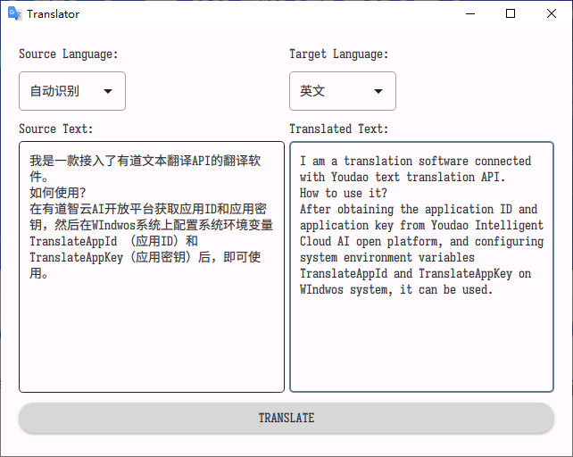
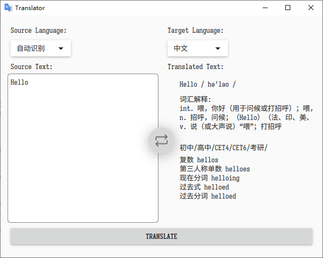

# 如何使用？
配置系统环境变量 `TranslateAppId` 和 `TranslateAppKey` ,然后启动软件即可。

# 文件夹结构
* `/app`: 包含应用程序的所有路由、组件和逻辑，这是您主要工作的地方。
* `/app/src`：包含应用程序中使用的函数，例如可重用的实用函数和数据获取函数。
* `/app/uikit`：包含应用程序的所有 UI 组件，例如卡片、表格和表单。为了节省时间，我们为您预先设计了这些组件的样式。
* `/app/assets`:包含应用程序的所有静态资源，例如图像。
* `/cmake`：包含cmake自定义函数脚本
